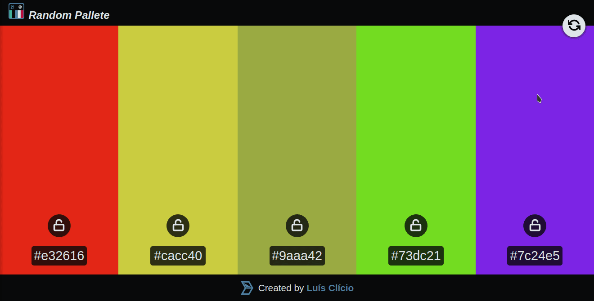

# [Random pallet](https://darktechlc.github.io/randompallete)

### Are you out of color ideas to use in the project? So, let chance choose for you!

- Generate random palettes
- Block colors to prevent change
- Click on a color to copy its hex code

> **Tip:** on the computer press the "space" key to generate a new palette!